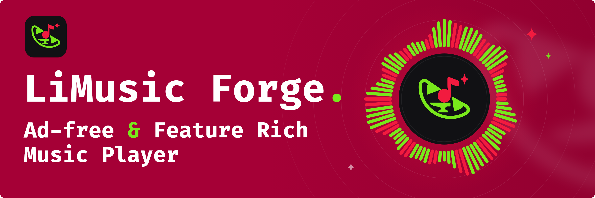
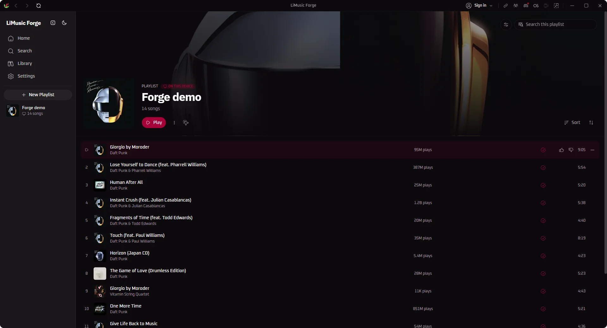
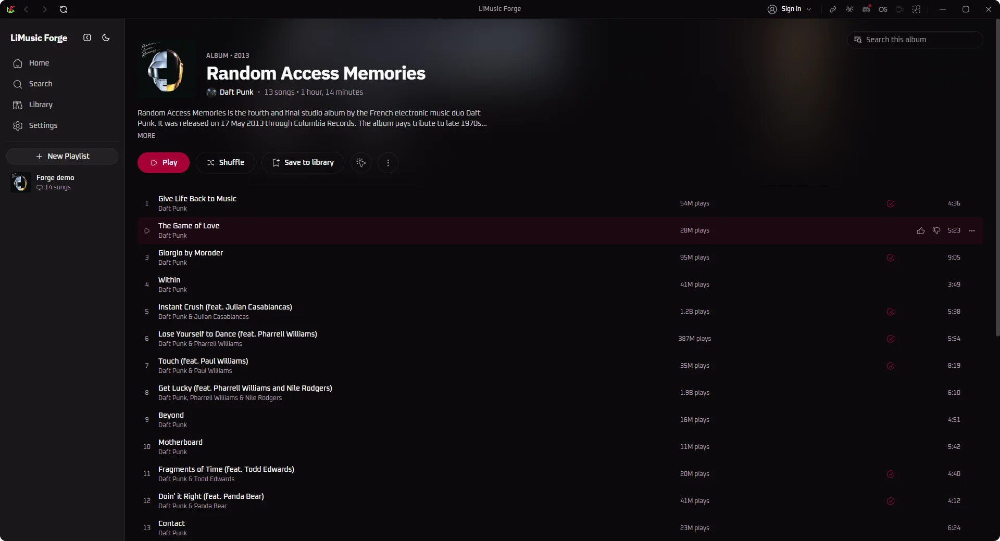
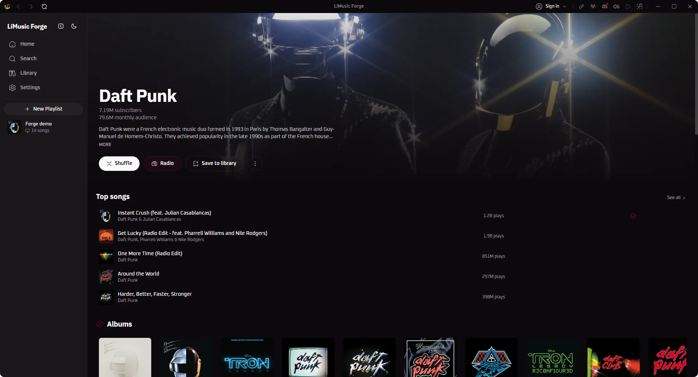

<div align="center">



# LiMusic Forge

**A native desktop YouTube Music client with playlist tools. Rust + Tauri, ad-free, no Electron.**

<p align="center">
  <a href="https://github.com/Kushro/limusic-forge/releases/latest"></a>
  
  <br>
  
  
  
  
  
</p>

**LiMusic Forge** is a fork of [LiMusic](https://github.com/SimoHypers/limusic) by SimoHypers.
It keeps everything LiMusic does (it talks directly to YouTube's internal API and plays audio
through libmpv: no bundled browser runtime, no backend server, no ads in the audio) and adds the
playlist management tools of PlaylistForge on top.

</div>

> **Modified version notice.** LiMusic Forge is a modified version of LiMusic, changed by Kushro
> in 2026. It is not the official LiMusic and is not supported by its author; please report
> problems with this fork [here](https://github.com/Kushro/limusic-forge/issues), not upstream.
> The full list of changes is the git history of this repository.

---

## What the fork adds

Playlist tools ported from PlaylistForge:

- **Reorder** playlists by dragging tracks, with the new order written back to YouTube Music
- **Copy or move by dropping**: drop tracks onto another playlist to copy them, or move them
- **Duplicates**: find and remove repeated tracks inside a playlist
- **Split and combine** playlists
- **Filters and export** of a playlist's tracks
- **Global view** of every track across all your playlists
- **Unavailable monitor**: spot tracks that YouTube has removed or made unplayable
- **Undo** for playlist operations

Also part of the fork's feature set, landing over time:

- Playlist monitoring and alerts
- Playlist backups as JSON snapshots, with retention
- Downloads
- An optional YouTube Data API mode
- An importer for PlaylistForge's library and backups

Plus Windows packaging that upstream doesn't ship: an offline installer that carries WebView2,
and a portable build that keeps all its data next to the executable.

---

## Features from LiMusic

- **Ad-free playback**: streams come straight from YouTube's API, ads never do
- **Search & browse**: songs, albums, artists, playlists and the YTM home feed, with results previewing as you type
- **Sign in** with your YouTube Music account: in-app Google login or cookie-paste, several accounts at once with switching between them
- **Your library**: playlists, liked songs, saved albums and artists, your uploads, and write actions (like, add to playlist, create/edit/delete playlists including cover art, subscribe, save to library)
- **History**: everything you have played, in YouTube Music's own day buckets
- **Gapless playback** with loudness normalization, powered by libmpv
- **Queue** with radio/automix continuation, drag to reorder, restored across restarts
- **Synced lyrics**: side panel with auto-scroll and click-to-jump, word by word where the source has the timings, with translations under each line
- **Music videos**: optional, the video plays where the artwork sits, with the same gapless audio behind it
- **Mini Player and theater mode**: shrink to a strip that keeps playing, or go fullscreen with cover and lyrics side by side
- **Local Music**: play your own files, with all metadata still intact
- **Last.fm scrobbling** and **Discord Rich Presence** (when the build is configured for them, see below)
- **OS media keys** and now-playing integration (MPRIS on Linux, SMTC on Windows, plus playback buttons on the Windows taskbar preview)
- **System tray**: close the window, keep the music; play/pause and skip from the tray, optional start-on-login
- **Listen Together**: synced listening rooms over a small self-hosted relay
- **Keyboard and mouse**: `Ctrl+K` searches from anywhere, `Ctrl+H` lists every shortcut, right-click menus throughout, `Ctrl` and the wheel zooms the interface
- **Many languages**: English, German, Spanish, French, Indonesian, Italian, Japanese, Korean, Polish, Brazilian Portuguese, Romanian, Russian, Turkish, Ukrainian and Traditional Chinese
- **Make it yours**: accent palettes, custom colors, your own fonts, corner roundness, a custom app icon, and an adaptive theme that recolors the app from the playing cover

---

## Screenshots

<table>
  <tr>
    <td colspan="2"></td>
  </tr>
  <tr>
    <td></td>
    <td></td>
  </tr>
</table>

---

<h2 align="center">Download & Install</h2>

<p align="center">
  <a href="https://github.com/Kushro/limusic-forge/releases/latest">
    
  </a>
</p>

Every build is published on the [releases page](https://github.com/Kushro/limusic-forge/releases)
of this repository.

| Platform | File | Notes |
|---|---|---|
| Windows | `-setup.exe` | Installer. Self-updating. Uses the WebView2 that Windows 10 and 11 already have |
| Windows | `-offline-setup.exe` | Same installer with WebView2 bundled, for machines without internet or without WebView2 |
| Windows | `-portable.zip` | No installation: unzip anywhere writable and run. Settings, accounts and caches stay in the `data` folder next to the exe. Does not self-update |
| Linux | `.AppImage` | Self-updating, libmpv bundled. Needs glibc 2.39+ (Ubuntu 24.04+, Debian 13+, Fedora 40+) |
| Linux (Ubuntu/Debian) | `.deb` | No self-update. Needs Ubuntu 24.04+ / Debian 13+; apt pulls libmpv and webkit2gtk in for you |
| macOS (Apple Silicon) | `.dmg` | Unsigned, so the first launch needs `xattr -dr com.apple.quarantine "/Applications/LiMusic Forge.app"` |

LiMusic Forge installs alongside LiMusic: it has its own app id and data folder, so the two
don't share settings or sign-ins. The community packages of upstream LiMusic (AUR, COPR, OBS)
install LiMusic, not this fork.

---

## Scrobbling & Discord

Both live in the title bar, next to the window controls.

- **Last.fm**: click the Last.fm mark, approve LiMusic Forge in the browser tab
  that opens, and you're connected for good. Tracks scrobble at the halfway point
  (or four minutes, whichever comes first), which is Last.fm's own rule. Click
  again to see the account or disconnect.
- **Discord**: click the Discord mark to toggle Rich Presence. Green dot means
  it's live. The card shows the track, artist, album art, and a progress bar, and
  it disappears when you pause.

Both need credentials that belong to whoever publishes the build. A build without
them still runs; the Last.fm and Discord buttons just say they aren't configured.
How to set them up for your own builds is in
[docs/RELEASING-FORK.md](docs/RELEASING-FORK.md).

Building from source? Get a Last.fm key at
[last.fm/api/account/create](https://www.last.fm/api/account/create) and put it in
`src-tauri/lastfm.keys`:

```
LIMUSIC_LASTFM_API_KEY=your_key
LIMUSIC_LASTFM_API_SECRET=your_secret
```

---

## Lyrics

Open the panel with the microphone button in the player bar, next to the queue
button. It takes the same side of the window as the queue, so opening one closes
the other.

Lyrics come from [Boidu](https://boidu.dev) first, then
[LRCLIB](https://lrclib.net), then YouTube Music's own timed lyrics, then
Netease, QQ Music and Kugou, falling back to plain un-timed text when nobody has
a synced version. Matching is keyed on the track's exact length, because popular
songs exist as several cuts and the wrong one drifts a few seconds out. Results
are cached locally, so replaying a track is instant.

Boidu is the only source with per-word timings, which is what lets a line
highlight word by word as it's sung. It goes first for that reason, which also
means it is asked about every track you play. Turn it off in **Settings ->
Playback -> Word-by-word lyrics** and the other sources still provide
line-by-line lyrics. Netease additionally supplies translations, shown under
each line where it has them.

Note that YouTube Music's lyrics are licensed per region and are missing
entirely in some countries. Where that's the case, LRCLIB does all the work.

---

## Listen Together

Synced listening with friends. Everyone streams their own audio from YouTube;
the room only relays play/pause, seeks, track changes and the queue. LiMusic
Forge ships without a default relay, so one person hosts it:

```bash
cargo run -p sync-server        # plain WebSocket on 0.0.0.0:8080
```

Front it with something that terminates TLS (Tailscale Funnel, Cloudflare
Tunnel), then paste the `wss://` URL into the server field of the Listen
Together panel. Rooms have join codes and the host approves every join and every
track suggestion.

---

## Translations

Translations are plain JSON files in `ui/src/lib/locales/`, with `en.json` as
the source of truth. They are contributed by pull request; anything untranslated
falls back to English in the app, so partial work is safe to submit. See
[CONTRIBUTING.md](CONTRIBUTING.md#translations).

---

## Building from Source

Fedora:

```bash
sudo dnf install mpv-libs mpv-libs-devel webkit2gtk4.1-devel \
  gcc gcc-c++ make openssl-devel librsvg2-devel
cd ui && pnpm install && cd ..
cargo tauri build
```

Windows and macOS instructions live in [docs/BUILD-PLATFORMS.md](docs/BUILD-PLATFORMS.md).

---

## How It Works, Briefly

- A pure Rust crate speaks YouTube's InnerTube API, impersonating several
  official client identities and falling back between them when one fails.
- YouTube's stream URLs are protected by obfuscated JavaScript (the signature
  cipher and the `n` parameter) and by BotGuard attestation. The app runs that
  JavaScript where it expects to run, in a real webview, hidden, and never lets
  any of it touch the UI process.
- Audio goes through libmpv: gapless transitions, an on-disk cache, and
  loudness normalization from YouTube's own metadata.
- The UI is a SvelteKit SPA that only ever talks to the Rust core. It never
  contacts YouTube itself.

---

## Credits

- [LiMusic](https://github.com/SimoHypers/limusic) by SimoHypers and contributors: the
  application this fork is built on. Nearly everything under "Features from LiMusic" is
  their work.
- [Metrolist](https://github.com/mostafaalagamy/Metrolist), the Android YouTube Music
  client whose playback engine LiMusic started as a desktop rebuild of.
- PlaylistForge, the playlist tools whose features this fork ports.

---

## Disclaimer

This project is not affiliated with, funded, authorized, endorsed by, or in
any way associated with YouTube, Google LLC, or any of their affiliates and
subsidiaries.

All trademarks, service marks, and intellectual property rights referenced in
this project belong to their respective owners.

---

## License

[GPL-3.0](LICENSE), the same license as LiMusic. Copyright © SimoHypers and
contributors; modifications in LiMusic Forge © 2026 Kushro. As required by
section 5(a) of the GPL, this is a modified version of LiMusic, and the
modifications are dated by the commits in this repository.
